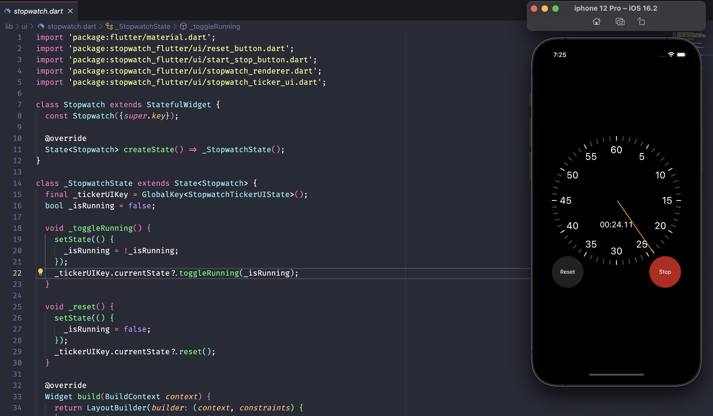
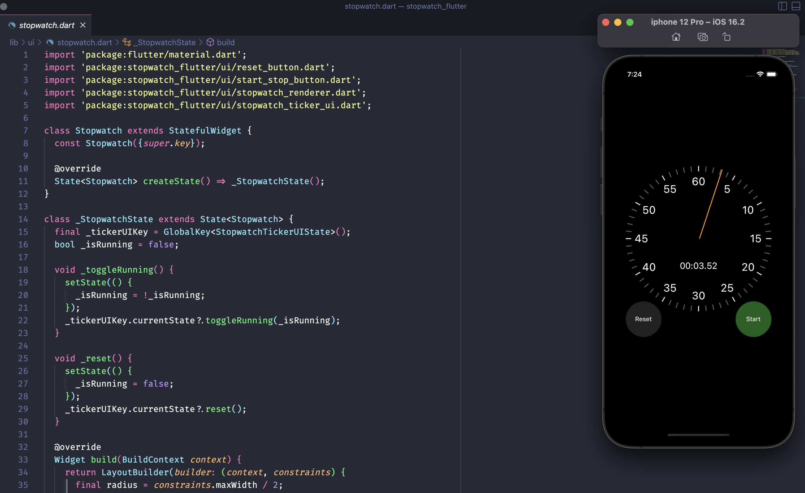

# FLutter Stopwatch | Guru Koding

Repo ini berisi kode yang digunakan dalam membuat aplikasi Stopwatch sederhana

## Feature yang di implementasikan
1. Ticker
2. Widget Transform
3. State Management Basic (setState)
4. Reusable Widget

### [LICENSE: MIT](LICENSE)

